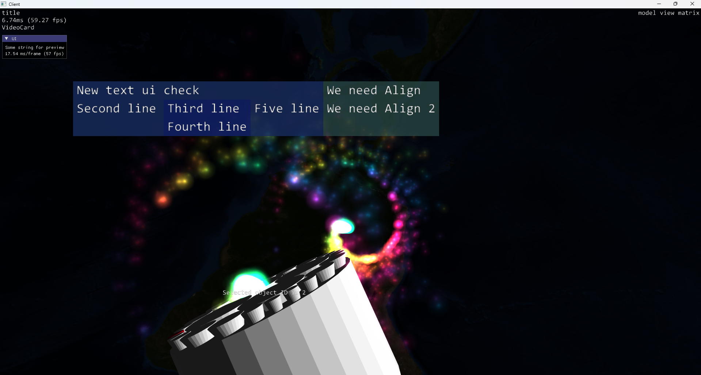

[Русская версия / Russian README](../../README.md)

[Документация / Documentation](../README.md)

# SkyEngineBase

## Description

**SkyEngineBase** is a developing 3D engine aimed at learning and demonstrating the use of the [Vulkan](https://vulkan.org/) graphics API.

The project supports multiple platforms:
- **Linux** (Debian-based images)
- **Windows** (MSVC and MinGW compilers)

---

## Dependencies

- [ImGui](https://github.com/ocornut/imgui) — for user interface
- [Vulkan API](https://vulkan.org/) — rendering core
- [GLFW](https://github.com/glfw/glfw) — cross-platform OS interaction
- [STB](https://github.com/nothings/stb.git) — image and texture loading
- [QT 5.14](https://www.qt.io/) — optional integration
- [Vulkan Examples](https://github.com/SaschaWillems/Vulkan) — learning materials

---

## Features

- Support for formats: **GLTF/GLB**, **OBJ**, and custom objects via vertex/index arrays
- Rendering of 3D and 2D objects with textures
- Particle system (CPU/GPU)
- Text rendering
- Volumetric lines using geometry shaders

---

## Test Examples

To demonstrate the rendering of different objects and support for various OS interaction libraries (QT/GLFW), two test cases are provided:
> tests/test1 — interface example with QT

> tests/test2 — interface example with GLFW

---

## Roadmap

- [ ] Set up CI/CD for automatic builds
  - [X] Windows build verification
  - [ ] Linux/Debian build verification via Docker
- [ ] Animation processing for gltf files
  - [ ] Detect available animations and expose them in the engine
- [ ] Camera class with scene positioning
- [ ] Scene format (json/xml, then binary)
- [X] Cursor position detection via pixel ownership (shaders + main thread)
- [X] Primitive classes (line, circle, rectangle)
  - Line via vertex buffer, circle and rectangle as special cases
- [ ] Downloadable resources for examples
  - [ ] Variations for different build types
- [ ] Doxygen documentation auto-generation via CMake
- [ ] Scene setup tool
- [ ] Adaptive object and complex surface generation

---

## Screenshots and Examples

> _Screenshots and usage examples will be updated in future versions._

---

## Contacts & Support

- [Issues](https://github.com/BarsSky/SkyEngine/issues) — for bugs and suggestions

---

**License:** MIT

---
